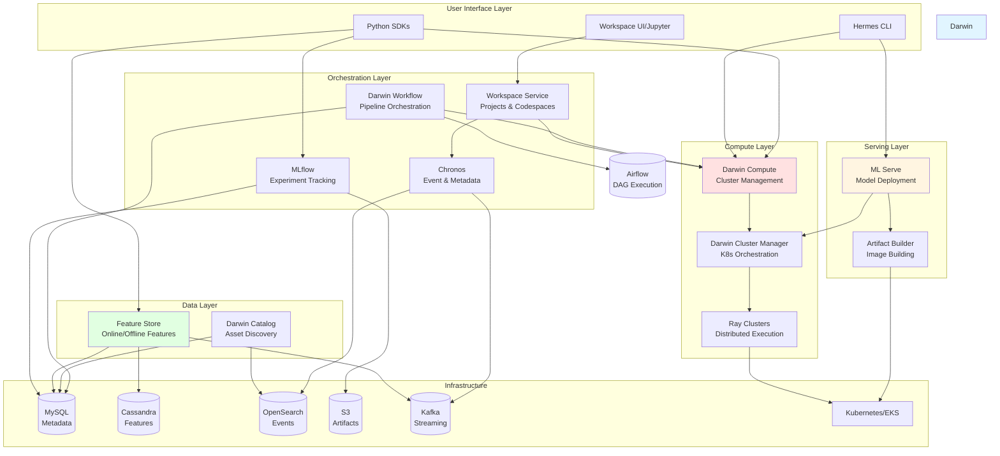
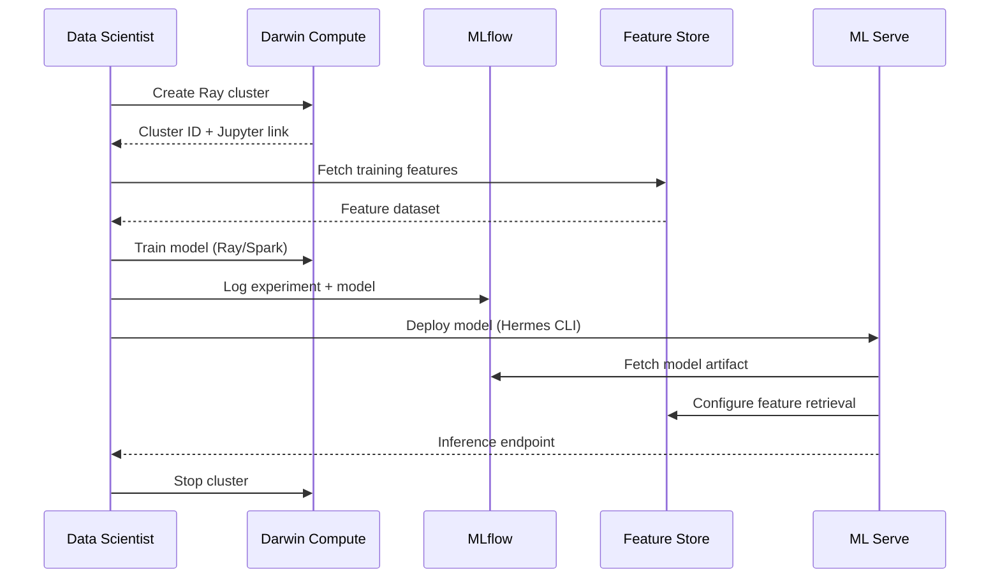
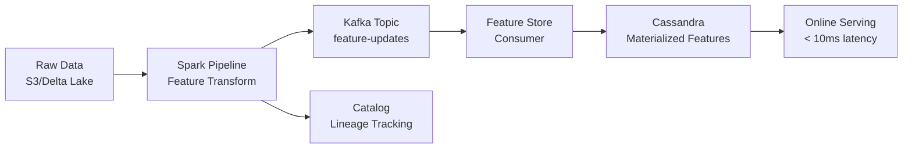

# Darwin ML Platform

🌐 **[Visit Darwin Platform](https://darwin.dreamhorizon.org/)**

**Darwin** is an enterprise-grade, end-to-end machine learning platform designed for production-scale AI/ML workloads. It provides a unified ecosystem for the complete ML lifecycle—from distributed compute and feature engineering to experiment tracking, model deployment, and real-time inference serving.

---

## 🎯 Why Darwin?

Darwin solves critical challenges in production ML infrastructure:

- **Unified Platform**: Single platform for training, serving, and feature engineering—no context switching between disparate tools
- **Production-Grade Scalability**: Built on Kubernetes and Ray for elastic, distributed compute at scale
- **Cost Optimization**: Intelligent auto-scaling, spot instance support, and policy-based auto-termination
- **Developer Velocity**: SDK-first design with CLI tools for rapid experimentation and deployment
- **Enterprise Ready**: Multi-tenancy, RBAC, audit logging, and metadata lineage out of the box
- **Low-Latency Serving**: Sub-10ms feature retrieval and optimized model inference pipelines

---

## 🏗️ Architecture Overview



---

## 📦 Platform Components

### 1. Darwin Compute
**Distributed compute orchestration for ML workloads**

- **Ray Cluster Management**: Create, scale, and manage Ray 2.37.0 clusters on Kubernetes
- **Multi-Runtime Support**: Pre-configured runtimes (Ray + Python 3.10 + Spark 3.5.1)
- **Resource Optimization**: 
  - Spot/on-demand instance mixing
  - Auto-termination policies (idle detection, CPU thresholds)
  - Cost monitoring with Slack alerts
- **Package Management**: Dynamic installation of PyPI, Maven, and workspace packages
- **Jupyter Integration**: Managed Jupyter notebooks with direct cluster access
- **Job Scheduling**: Ray job submission and monitoring

**SDK**: `darwin-compute`
```python
from darwin_compute import ComputeCluster

cluster = ComputeCluster(env="prod")
result = cluster.create_with_yaml("cluster-config.yaml")
cluster.start(cluster_id=result['cluster_id'])
```

---

### 2. Darwin Cluster Manager (DCM)
**Low-level Kubernetes orchestration service (Go)**

- Helm-based Ray cluster deployment via KubeRay operator
- Dynamic values.yaml generation for cluster configurations
- Remote command execution on cluster pods
- Jupyter pod lifecycle management
- FastAPI serve deployment orchestration

---

### 3. Feature Store
**High-performance feature serving and engineering platform**

**Components**:
- **darwin-ofs-v2** (App): Low-latency online feature serving (<10ms)
- **darwin-ofs-v2-admin**: Feature group management, schema versioning
- **darwin-ofs-v2-consumer**: Kafka-based feature materialization
- **darwin-ofs-v2-populator**: Bulk ingestion from Parquet/Delta tables

**Capabilities**:
- Real-time feature retrieval with Cassandra backend
- Point-in-time correctness for training datasets
- Feature validation and schema evolution
- Spark integration for batch feature pipelines
- Multi-tenant feature isolation

**Storage Architecture**:
- **Cassandra**: High-throughput feature values
- **MySQL**: Feature metadata and schemas
- **Kafka**: Real-time feature streaming

**SDK**: `darwin_fs`
```python
from darwin_fs import FeatureStoreClient

fs = FeatureStoreClient()
features = fs.fetch_features(
    feature_group="user_engagement",
    keys=[123, 456]
)
```

---

### 4. ML Serve
**Production model deployment and serving platform**

- **Serve Lifecycle**: Create, configure, deploy, monitor, undeploy
- **Multi-Environment**: Dev, staging, UAT, production with environment-specific configs
- **Backend Support**: 
  - FastAPI serves for REST inference
  - Ray Serve for distributed model serving (experimental)
- **Artifact Management**: Git-based Docker image builds
- **Auto-Scaling**: HPA-based horizontal pod autoscaling
- **Feature Store Integration**: Native integration for online feature retrieval

**Deployment Workflow**:
```bash
# Complete model deployment via Hermes CLI

# 1. Configure authentication
export HERMES_USER_TOKEN=admin-token-default-change-in-production
hermes configure

# 2. Create environment (one-time setup)
hermes create-environment --name local --domain-suffix .local --cluster-name kind

# 3. Create serve definition
hermes create-serve --name my-model --type api --space serve --description "My ML model"

# 4. Deploy model
hermes deploy-model \
  --serve-name my-model \
  --artifact-version v1 \
  --model-uri mlflow-artifacts:/1/abc123/artifacts/model \
  --cores 4 \
  --memory 8 \
  --node-capacity spot \
  --min-replicas 2 \
  --max-replicas 10
```

> **📖 For detailed Hermes CLI commands and options, see [hermes-cli/CLI.md](hermes-cli/CLI.md)**

---

### 5. Artifact Builder
**Docker image building service for ML models**

- Build images from GitHub repositories with custom Dockerfiles
- Queue-based build system with status tracking
- Container registry integration (ECR, GCR)
- Integration with ML Serve deployment pipeline

---

### 6. Darwin MLflow
**Experiment tracking and model registry**

- **MLflow 2.12.2** with custom FastAPI authentication layer
- Experiment and run tracking (parameters, metrics, artifacts)
- Model registry with versioning
- User-based experiment permissions
- S3/LocalStack artifact storage
- Custom UI with enhanced authorization

**SDK**: `darwin_mlflow` (wraps MLflow client)
```python
import darwin_mlflow as mlflow

mlflow.log_params({"lr": 0.001, "epochs": 100})
mlflow.log_metric("accuracy", 0.95)
mlflow.sklearn.log_model(model, "model")
```

---

### 7. Chronos (Event Processing & Metadata)
**Event ingestion, transformation, and lineage tracking**

- **Event Sources**: REST API for raw events from services
- **Transformers**: Python/JSONPath-based event processing
- **Entity Extraction**: Automatic entity creation (clusters, users, jobs)
- **Relationship Mapping**: Build lineage graphs between entities
- **Queue Processing**: Async consumption from Kafka/SQS

**Use Cases**:
- Cluster lifecycle tracking
- Workflow execution lineage
- Audit logs and compliance
- Metadata dependencies (data → model → deployment)

---

### 8. Darwin Workspace
**Project and development environment management**

- **Project Management**: Multi-user project organization
- **Codespace Lifecycle**: Create and manage Jupyter/VSCode environments
- **Compute Integration**: Attach Ray clusters to development environments
- **Shared Storage**: FSx/EFS integration for persistent workspaces
- **Event Publishing**: Workspace state changes tracked in Chronos

---

### 9. Darwin Catalog
**Data asset discovery and governance**

- **Asset Management**: Register datasets, tables, models
- **Schema Tracking**: Schema evolution and versioning
- **Lineage**: OpenLineage-based data lineage tracking
- **Search**: Full-text search across data assets
- **Metadata**: Tags, descriptions, ownership, quality metrics
- **Integration**: Spark and Airflow job lineage capture

---

### 10. Darwin Workflow
**ML pipeline orchestration and scheduling**

- **Workflow Definition**: Define multi-step ML pipelines with task dependencies
- **DAG Management**: Create, deploy, and manage Airflow DAGs programmatically
- **Job Cluster Integration**: Automatic Ray cluster provisioning for workflow tasks
- **Conditional Execution**: Support for branching and conditional task execution
- **Callback Events**: Event-driven notifications on workflow state changes

**Components**:
- **App Layer**: FastAPI REST API for workflow management
- **Core**: Workflow orchestration logic and DAG services
- **Airflow Integration**: Custom operators for Darwin platform integration
- **SDK**: Python SDK with CLI for workflow creation and management

**SDK**: `darwin_workflow`
```python
from darwin_workflow import WorkflowClient

client = WorkflowClient(env="prod")

# Create a workflow
workflow = client.create_workflow(
    name="feature-pipeline",
    tasks=[
        {"name": "extract", "type": "ray_job", "script": "extract.py"},
        {"name": "transform", "type": "ray_job", "script": "transform.py", "depends_on": ["extract"]},
        {"name": "load", "type": "ray_job", "script": "load.py", "depends_on": ["transform"]}
    ]
)

# Trigger workflow run
client.trigger_workflow(workflow_id=workflow['id'])
```

**Use Cases**:
- Scheduled feature engineering pipelines
- Model retraining workflows
- Data processing DAGs with Ray/Spark tasks
- Multi-step ML experiments with dependencies

---

### 11. Hermes CLI
**Command-line tool for streamlined ML operations**

- Environment configuration and management
- Model serving project scaffolding (FastAPI templates)
- One-click model deployment
- Artifact build and deploy orchestration
- Configuration management (`.hermes` folder)

**Installation & Setup**:
```bash
# Included with Darwin Distribution
source hermes-cli/.venv/bin/activate

# Configure authentication
export HERMES_USER_TOKEN=admin-token-default-change-in-production
hermes configure

# Create environment (one-time setup per environment)
hermes create-environment \
  --name local \
  --domain-suffix .local \
  --cluster-name kind \
  --namespace serve
```

> **📖 For complete Hermes CLI documentation, see [hermes-cli/CLI.md](hermes-cli/CLI.md)**

---

## 👥 User Personas

### Data Scientists
**Use Darwin for**: Experimentation, training, model development
- Launch Ray clusters via SDK for distributed training
- Track experiments with MLflow
- Access features from Feature Store
- Deploy models with one-click Hermes CLI commands

### ML Engineers
**Use Darwin for**: Production model deployment and monitoring
- Configure multi-environment serves (dev/staging/prod)
- Build and deploy artifacts from GitHub
- Manage auto-scaling policies
- Monitor model performance and resource usage

### Data Engineers
**Use Darwin for**: Feature pipelines and data infrastructure
- Create and manage feature groups in Feature Store
- Build Spark-based feature engineering pipelines
- Track data lineage in Catalog
- Publish features to Kafka for real-time materialization

### Platform Engineers
**Use Darwin for**: Infrastructure management and operations
- Deploy and configure Darwin platform via Helm
- Manage Kubernetes resources and policies
- Monitor costs and resource utilization
- Configure multi-tenancy and RBAC

---

## 🚀 Getting Started

### Prerequisites
- Kubernetes cluster (Kind for local, EKS for production)
- Helm 3.8+
- kubectl
- Docker
- Python 3.9.7+

### Quick Start: Local Deployment

```bash
# 1. Initialize configuration (select your use case)
./init.sh

# 2. Build platform images and setup Kind cluster
./setup.sh              # Interactive mode
./setup.sh -y           # Non-interactive (keeps existing data)
./setup.sh -y --clean   # Non-interactive clean install

# 3. Deploy Darwin platform to Kubernetes
./start.sh
```

#### Choosing Your Use Case

By default, `init.sh` offers two simplified presets:

| Preset | Features | Use Case |
|--------|----------|----------|
| **Training** | Compute + MLFlow | Model training, experiments, distributed compute with Ray clusters |
| **Inference** | Serve + MLFlow | Model deployment, real-time inference endpoints |

You can select one or both presets. Dependencies are automatically resolved.

#### Advanced: Granular Service Selection

For fine-grained control over individual services, use **dev mode**:

```bash
./init.sh --dev-mode
```

This enables the original service-by-service selection:

| If you want to... | Enable |
|-------------------|--------|
| Run distributed data processing jobs or spin up short-lived compute clusters | **Compute** |
| Work interactively with persistent code and notebooks attached to scalable clusters | **Workspace** (includes Compute) |
| Store, version, and serve features for ML training and inference | **Feature Store** |
| Track experiments, log metrics, and manage model versions | **MLflow** |
| Deploy trained models as real-time inference endpoints | **Serve** (includes Artifact Builder) |
| Discover and track lineage across datasets, models, and pipelines | **Catalog** |
| Capture platform events and build metadata graphs | **Chronos** |
| Orchestrate multi-step ML pipelines with scheduling and dependencies | **Workflow** (includes Compute, Airflow) |

> **Tip**: Dependencies are resolved automatically. For example, enabling **Workspace** will also enable **Compute**, and enabling **Serve** will include **Artifact Builder** and **MLflow**.

**Access Services**:
- Compute: `http://localhost/compute/*`
- Feature Store: `http://localhost/feature-store/*`
- MLflow UI: `http://localhost/mlflow/*`
- Chronos API: `http://localhost/chronos/*`
- Catalog API: `http://localhost/darwin-catalog/*`
- Workspace: `http://localhost/workspace/*`
- Workflow: `http://localhost/workflow/*`

### Quick Start: Create and Use a Ray Cluster

```bash
# Create a cluster via REST API
curl --location 'http://localhost/compute/cluster' \
  --header 'Content-Type: application/json' \
  --data-raw '{
    "cluster_name": "my-first-cluster",
    "tags": ["demo"],
    "runtime": "0.0",
    "inactive_time": 30,
    "start_cluster": true,
    "head_node_config": {
        "cores": 4,
        "memory": 8,
        "node_capacity_type": "ondemand"
    },
    "worker_node_configs": [
        {
            "cores_per_pods": 2,
            "memory_per_pods": 4,
            "min_pods": 1,
            "max_pods": 2,
            "disk_setting": null,
            "node_capacity_type": "ondemand"
        }
    ],
    "user": "user@example.com"
}'

# Wait for Cluster to become Active
curl http://localhost/compute/cluster/{cluster_id}/metadata
# Wait until the status shows active.

# Response will include cluster_id
# Get Cluster Dashboards link via below API using cluster_id
curl --location 'http://localhost/compute/cluster/{cluster_id}/dashboards'
# Access Jupyter notebook at the returned jupyter_lab_url
# Monitor Ray cluster at the ray_dashboard_url

# Stop the cluster when done
curl --location --request POST 'http://localhost/compute/cluster/stop-cluster/{cluster_id}' \
  --header 'msd-user: {"email": "user@example.com"}'
```

**Understanding Runtime Parameter:**

The `runtime` field specifies which pre-built Docker image to use for your Ray cluster. Darwin supports multiple runtimes with different Python versions and pre-installed libraries:

- `"0.0"`: Default runtime with Ray 2.37.0, Python 3.10, Spark 3.5.1, and darwin-sdk
- Custom runtimes can be registered with specific library combinations

To check available runtimes:
```bash
curl http://localhost/compute/get-runtimes | python3 -m json.tool
```

**Or use the Python SDK:**

```python
# Install SDK
pip install -e darwin-compute/sdk

# Create a cluster
from darwin_compute import ComputeCluster

cluster = ComputeCluster(env="darwin-local")
response = cluster.create_with_yaml("examples/cluster-config.yaml")
cluster_id = response['cluster_id']

# Check and wait until cluster status becomes active
cluster.get_info(cluster_id)

# Stop when done
cluster.stop(cluster_id)
```

### Quick Start: Deploy a Model

```bash
# Activate Hermes CLI
source hermes-cli/.venv/bin/activate

# 1. Configure Hermes CLI with authentication token
export HERMES_USER_TOKEN=admin-token-default-change-in-production
hermes configure

# 2. Create environment
hermes create-environment --name local --domain-suffix .local --cluster-name kind

# 3. Create serve
hermes create-serve \
  --name iris-classifier \
  --type api \
  --space serve \
  --description "Iris classification model"

# 4. Deploy model (one-click)
hermes deploy-model \
  --serve-name iris-classifier \
  --artifact-version v1 \
  --model-uri mlflow-artifacts:/1/2b2b1b5727a14c5ca81b44e899979745/artifacts/model \
  --cores 2 \
  --memory 4 \
  --node-capacity spot \
  --min-replicas 1 \
  --max-replicas 2

# 5. Make predictions
curl -X POST http://localhost/iris-classifier/predict \
  -H "Content-Type: application/json" \
  -d '{"features": [[5.1, 3.5, 1.4, 0.2]]}'
```

> **📖 For more deployment options, see [hermes-cli/CLI.md](hermes-cli/CLI.md)**

### Quick Start: Use Feature Store

```python
# Install SDK
pip install -e feature-store/python/darwin_fs

# Fetch features
from darwin_fs import FeatureStoreClient

fs = FeatureStoreClient(env="local")
features = fs.fetch_features(
    feature_group_name="user_features",
    feature_columns=["age", "tenure", "activity_score"],
    primary_key_names=["user_id"],
    primary_key_values=[[123], [456], [789]]
)
```

---

## 🎯 Quick Start: Submit a Spark Job Using Darwin SDK

Darwin SDK provides seamless integration with Apache Spark on Ray clusters. Here's how to run distributed Spark workloads using Darwin as your Spark session provider:

### Step 1: Create a Ray Cluster

```bash
curl --location 'http://localhost/compute/cluster' \
  --header 'Content-Type: application/json' \
  --data-raw '{
    "cluster_name": "spark-demo-cluster",
    "tags": ["spark", "demo"],
    "runtime": "0.0",
    "inactive_time": 60,
    "start_cluster": true,
    "head_node_config": {
        "cores": 4,
        "memory": 8,
        "node_capacity_type": "ondemand"
    },
    "worker_node_configs": [{
        "cores_per_pods": 2,
        "memory_per_pods": 4,
        "min_pods": 1,
        "max_pods": 2,
        "disk_setting": null,
        "node_capacity_type": "ondemand"
    }],
    "user": "user@example.com"
}'
```

Save the `cluster_id` from the response.

### Step 2: Wait for Cluster to be Ready

```bash
# Check cluster status
curl http://localhost/compute/cluster/{cluster_id}/metadata

# Wait until status shows "active"
# Then verify pods are running
kubectl get pods -n ray -l ray.io/cluster={cluster_id}-kuberay
```

### Step 3: Create Your Spark Job

Create a file `my_spark_job.py`:

```python
#!/usr/bin/env python3
"""
Darwin SDK Spark Job Example
"""
import os
import ray

# Initialize Ray (connects to running Ray cluster)
ray.init()

# Set environment variables
os.environ["ENV"] = "LOCAL"
os.environ["CLUSTER_ID"] = os.getenv("CLUSTER_ID", "your-cluster-id")
os.environ["DARWIN_COMPUTE_URL"] = "http://darwin-compute.darwin.svc.cluster.local:8000"

print("=" * 60)
print("Darwin SDK Spark Job")
print(f"Cluster ID: {os.environ['CLUSTER_ID']}")
print("=" * 60)

# Initialize Spark using darwin-sdk
from darwin import init_spark_with_configs

spark_configs = {
    "spark.sql.execution.arrow.pyspark.enabled": "true",
    "spark.sql.session.timeZone": "UTC",
    "spark.sql.shuffle.partitions": "10",
    "spark.default.parallelism": "10",
    "spark.driver.memory": "1g",
    "spark.executor.memory": "1g",
}

spark = init_spark_with_configs(spark_configs=spark_configs)
print(f"✓ Spark initialized (version: {spark.version})")

# Create and process DataFrame
df = spark.createDataFrame([
    (1, "Alice", 100),
    (2, "Bob", 200),
    (3, "Charlie", 300),
], ["id", "name", "score"])

print("\nDataFrame Contents:")
df.show()

print(f"\nTotal records: {df.count()}")
print(f"Average score: {df.agg({'score': 'avg'}).collect()[0][0]}")

# Stop Spark cleanly
from darwin import stop_spark
stop_spark()

print("\n✓ Job completed successfully!")
```

### Step 4: Submit the Job

**Option A: Using submit_spark_job.sh Script**

```bash
cd darwin-sdk/darwin
./submit_spark_job.sh \
  --cluster-name {cluster_id} \
  --namespace ray \
  --job-file /path/to/my_spark_job.py \
  --wait
```

**Option B: Using Ray Jobs API**

```bash
# Port-forward to Ray dashboard
kubectl port-forward -n ray svc/{cluster_id}-kuberay-head-svc 8265:8265 &

# Submit job
curl -X POST "http://localhost:8265/api/jobs/" \
  -H "Content-Type: application/json" \
  -d '{
    "entrypoint": "python my_spark_job.py",
    "runtime_env": {
      "working_dir": "./",
      "env_vars": {
        "CLUSTER_ID": "'{cluster_id}'",
        "ENV": "LOCAL"
      }
    },
    "metadata": {
      "name": "darwin-spark-demo"
    }
  }'
```

**Option C: Using Ray Python Client**

```python
from ray.job_submission import JobSubmissionClient

client = JobSubmissionClient("http://localhost:8265")

job_id = client.submit_job(
    entrypoint="python my_spark_job.py",
    runtime_env={
        "working_dir": "./",
        "env_vars": {
            "CLUSTER_ID": "{cluster_id}",
            "ENV": "LOCAL"
        }
    }
)

print(f"Submitted job: {job_id}")

# Wait for completion
client.wait_until_status(job_id, "SUCCEEDED")
print(client.get_job_logs(job_id))
```

### Step 5: Monitor Job Execution

```bash
# Check job status
SUBMISSION_ID="raysubmit_xxxxxxxx"
curl "http://localhost:8265/api/jobs/${SUBMISSION_ID}"

# View job logs
curl "http://localhost:8265/api/jobs/${SUBMISSION_ID}/logs"

# Or use Ray Dashboard
open http://localhost:8265
```

### Darwin SDK Spark Functions

| Function | Description |
|----------|-------------|
| `init_spark_with_configs(spark_configs)` | Initialize Spark with custom configurations |
| `start_spark(spark_conf)` | Start Spark with default Glue catalog configs |
| `get_raydp_spark_session()` | Get existing Spark session |
| `stop_spark()` | Stop Spark session cleanly |

### Troubleshooting

**Issue: "Runtime given is incorrect"**
```bash
# Check available runtimes
curl http://localhost/compute/get-runtimes
```

**Issue: Ray job stuck in PENDING**
```bash
# Check Ray head pod
kubectl describe pod {cluster_id}-kuberay-head-xxx -n ray
```

**Issue: Connection refused when submitting job**
```bash
# Restart port-forward
pkill -f "port-forward.*8265"
kubectl port-forward -n ray svc/{cluster_id}-kuberay-head-svc 8265:8265 &
```

**Issue: Cluster not starting due to long init script**

If your `init_script` in the cluster configuration is too long, the cluster may fail to start. This happens because init scripts are executed during pod startup and have timeout limitations.

**Solutions:**
- Use the **Library Installation API** to install packages instead of init scripts
- Create a **custom runtime** with your dependencies pre-installed
- Split long scripts into smaller, essential commands

---

## 🧪 Creating Your First Project

This guide walks you through your first end-to-end experience on Darwin — from compute creation to deployment.

### 🔧 1) Create Compute

Create a Ray cluster for your ML workload:

```bash
curl --location 'http://localhost/compute/cluster' \
  --header 'Content-Type: application/json' \
  --data-raw '{
    "cluster_name": "housing-project",
    "tags": ["tutorial", "housing-prices"],
    "runtime": "0.0",
    "inactive_time": 60,
    "head_node_config": {
        "cores": 4,
        "memory": 8
    },
    "worker_node_configs": [
        {
            "cores": 2,
            "memory": 4,
            "min_pods": 1,
            "max_pods": 2
        }
    ],
    "user": "user@example.com"
}'
```

Save the `cluster_id` from the response - you'll need it for the next steps.

### 📊 2) Check Status

Check your cluster status:

```bash
curl http://localhost/compute/cluster/{cluster_id}/metadata
```

**Wait until the status shows active.**

### 📓 3) Open Jupyter Notebook

Once the cluster is ready, access the Jupyter notebook at:

```
http://localhost/kind-0/{cluster_id}-jupyter
```

Open this URL in your browser to start working in the workspace.

### 🏡 4) Copy and Run Example: housing-prices

In the Jupyter notebook, copy the example project: /examples/housing-prices/ in Jupyter notebook. The model will be logged automatically to MLflow.

### 🏷️ 5) Check Your Model in the Registry

Verify your trained model in the Darwin MLflow UI:

```
http://localhost/mlflow-app/experiments
```

Navigate to your experiment to see the registered model with metrics and parameters.

### 🚀 6) Deploy with Hermes CLI

Deploy your trained model (replace `<experiment_id>` and `<run_id>` with values from MLflow UI):

> **📖 Sample training script for house price prediction: [examples/house-price-prediction/train_house_pricing_model.ipynb](examples/house-price-prediction/train_house_pricing_model.ipynb)**

```bash
# Activate Hermes CLI
source hermes-cli/.venv/bin/activate

# 1. Configure Hermes CLI with authentication token (one-time)
export HERMES_USER_TOKEN=admin-token-default-change-in-production
hermes configure

# 2. Create environment
hermes create-environment --name local --domain-suffix .local --cluster-name kind

# 3. Create serve
hermes create-serve \
  --name housing-model \
  --type api \
  --space serve \
  --description "House Price Prediction model"

# 4. Deploy model (one-click)
hermes deploy-model \
  --serve-name housing-model \
  --artifact-version v1 \
  --model-uri mlflow-artifacts:/1/<experiment_id>/<run_id>/artifacts/model \
  --cores 2 \
  --memory 4 \
  --node-capacity spot \
  --min-replicas 1 \
  --max-replicas 2
```

### 🌐 7) Test Your Endpoint

Test your deployed model:

```bash
curl -X POST http://localhost/housing-model/predict \
  -H "Content-Type: application/json" \
  -d '{
    "features": {
      "MedInc": 3.5214,
      "HouseAge": 15.0,
      "AveRooms": 6.575757575757576,
      "AveBedrms": 1.0196969696969697,
      "Population": 1447.0,
      "AveOccup": 3.0144927536231883,
      "Latitude": 37.63,
      "Longitude": -122.43
    }
  }'
```

Once deployed, your model is accessible as a real-time inference API.

---

### 🌸 Alternative Example: Iris Classification

You can also try the Iris classification model as an alternative example:

> **📖 Sample training script for iris classification: [examples/iris-classification/train_iris_model.ipynb](examples/iris-classification/train_iris_model.ipynb)**

**Deploy the Iris model:**

```bash
# Activate Hermes CLI
source hermes-cli/.venv/bin/activate

# 1. Configure Hermes CLI with authentication token (one-time)
export HERMES_USER_TOKEN=admin-token-default-change-in-production
hermes configure

# 2. Create environment
hermes create-environment --name local --domain-suffix .local --cluster-name kind

# 3. Create serve
hermes create-serve \
  --name iris-classifier \
  --type api \
  --space serve \
  --description "Iris Species Classification model"

# 4. Deploy model (one-click)
hermes deploy-model \
  --serve-name iris-classifier \
  --model-uri mlflow-artifacts:/<experiment_id>/<run_id>/artifacts/model \
  --cores 2 \
  --memory 4 \
  --node-capacity spot \
  --min-replicas 1 \
  --max-replicas 2
```

**Test the Iris model:**

```bash
curl -X POST http://localhost/iris-classifier/predict \
  -H "Content-Type: application/json" \
  -d '{
    "features": {
      "sepal_length": 5.1,
      "sepal_width": 3.5,
      "petal_length": 1.4,
      "petal_width": 0.2
    }
  }'
```

> **📖 For detailed deployment commands, see [hermes-cli/CLI.md](hermes-cli/CLI.md)**

---

## 🧪 Example Workflows

### End-to-End ML Workflow



### Feature Engineering Pipeline



---

## 📊 Technology Stack

| Layer | Technologies |
|-------|-------------|
| **Languages** | Python 3.9.7, Java 11, Go 1.18 |
| **Compute** | Ray 2.37.0, Apache Spark 3.5.1 |
| **Web Frameworks** | FastAPI, Spring Boot, Vert.x |
| **Orchestration** | Kubernetes (EKS/Kind), Helm 3, KubeRay Operator v1.1.0 |
| **Databases** | MySQL 8.0, Cassandra 5.0, OpenSearch 2.11 |
| **Streaming** | Apache Kafka 7.4.0 |
| **Storage** | S3 (AWS/LocalStack), FSx, EFS |
| **Experiment Tracking** | MLflow 2.12.2 |
| **Monitoring** | Prometheus, Grafana, Ray Dashboard |
| **Container Registry** | ECR, GCR, Local Docker Registry |

---

## 🔧 Configuration

Darwin uses a declarative configuration approach:

### Service Selection (`init.sh`)
Interactive wizard to select platform components:

**Default Mode** - Simplified preset selection:
```bash
./init.sh
# Prompts for:
# - Training preset (Compute + MLFlow)
# - Inference preset (Serve + MLFlow)
```

**Dev Mode** - Granular service-by-service selection:
```bash
./init.sh --dev-mode
# Prompts for enabling individual:
# - Applications (Compute, Feature Store, MLflow, etc.)
# - Datastores (MySQL, Cassandra, Kafka, etc.)
# - Ray images and Serve runtimes
```

**All Mode** - Enable everything:
```bash
./init.sh --all
# Enables all services without prompts
```

Generates `.setup/enabled-services.yaml` with user selections.

### Environment Variables
Key configuration via `.setup/config.env` (auto-generated):
```bash
KUBECONFIG=./.setup/kindkubeconfig.yaml
DOCKER_REGISTRY=127.0.0.1:32768
```

### Helm Values
Customize deployments via `helm/darwin/values.yaml`:
```yaml
global:
  namespace: darwin
  
services:
  compute:
    enabled: true
    replicas: 2
  
datastores:
  mysql:
    enabled: true
  cassandra:
    enabled: true
```

---

## 🏢 Deployment Patterns

### Local Development (Kind)
- Single-node Kubernetes cluster
- Local Docker registry
- HostPath-based persistent storage
- Nginx Ingress at `localhost/*`

### Production (EKS)
- Multi-AZ high availability
- Mixed spot/on-demand node groups
- Auto-scaling with Karpenter
- Network policies and security groups
- S3-backed artifact storage
- RDS for MySQL (optional)
- Multi-tenant namespace isolation

---

## 📈 Observability

### Metrics
- **Prometheus**: Cluster resource utilization, service metrics
- **Grafana**: Pre-configured dashboards for compute, serving, features
- **Ray Dashboard**: Job execution, task profiling, resource usage

### Logging
- Centralized logging via stdout/stderr
- Application logs in `/app/logs`
- Structured logging with context

### Events & Lineage
- **Chronos**: Event-driven tracking of all platform operations
- **Catalog**: Data lineage via OpenLineage
- Elasticsearch-based search and analytics

### Alerts
- Slack integration for cost alerts
- Long-running cluster notifications
- Failed deployment alerts

---

## 📚 SDKs & APIs

### Available SDKs
- **darwin-compute**: Ray cluster management
- **darwin_fs**: Feature Store client
- **darwin_mlflow**: MLflow wrapper with auth
- **darwin-workspace** (internal): Workspace orchestration
- **darwin_workflow**: Workflow orchestration and pipeline management

### REST APIs
All services expose FastAPI/Spring Boot REST APIs:
- Feature Store: `/feature-store/*`, `/feature-store-admin/*`
- Darwin Compute: `/cluster/*`, `/jupyter/*`
- ML Serve: `/api/v1/serve/*`, `/api/v1/artifact/*`
- Chronos: `/api/v1/event/*`, `/api/v1/sources/*`
- Catalog: `/v1/assets/*`, `/v1/lineage/*`
- Workflow: `/api/v3/workflow/*`, `/api/v3/workflow-run/*`

API documentation available at `<service-url>/docs` (Swagger UI).

---

## 🧩 Extensibility

### Available Runtimes

Darwin provides pre-built Ray runtimes for cluster creation. The **Runtime Name** is what you pass to the API when creating clusters (e.g., `"runtime": "0.1"`).

| Runtime Name | Image | Ray Version | Python | Class | Type |
|--------------|-------|-------------|--------|-------|------|
| 0.0 | ray:2.37.0 | 2.37.0 | 3.10 | CPU | Ray Only |
| 0.1 | ray:2.53.0 | 2.53.0 | 3.10 | CPU | Ray Only |

### Custom Runtimes
Add new Ray runtimes by creating Dockerfiles in `darwin-compute/runtimes/`:
```dockerfile
# darwin-compute/runtimes/cpu/Ray2.37_Py3.11_CustomLibs/Dockerfile
FROM rayproject/ray:2.37.0-py311
RUN pip install jupyterlab==4.3.0
RUN pip install custom-library
```

Register in `services.yaml`:
```yaml
ray-images:
  - image-name: ray:2.37.0-py311-custom
    dockerfile-path: darwin-compute/runtimes/cpu/Ray2.37_Py3.11_CustomLibs
```

### Custom Transformers (Chronos)
Create Python transformers for event processing:
```python
# Chronos transformer
def transform(event):
    return {
        "event_type": "cluster_created",
        "entities": [{"type": "cluster", "id": event["cluster_id"]}],
        "relationships": [{"from": user, "to": cluster, "type": "owns"}]
    }
```

---

## 🤝 Contributing

See [CONTRIBUTING.md](CONTRIBUTING.md) for development setup, coding standards, and contribution guidelines.

---

## 📄 License

[License information to be added]

---

## 📞 Support

For issues, questions, or feature requests, please open an issue in the repository or contact the platform team.

---

## 🗺️ Project Structure

```
darwin-distro/
├── darwin-compute/          # Ray cluster management service
├── darwin-cluster-manager/  # Kubernetes orchestration (Go)
├── darwin-workflow/         # ML pipeline orchestration (Airflow integration)
├── feature-store/           # Feature Store (Java)
├── mlflow/                  # MLflow experiment tracking
├── ml-serve-app/            # Model serving platform
├── artifact-builder/        # Docker image builder
├── chronos/                 # Event processing & metadata
├── workspace/               # Project & codespace management
├── darwin-catalog/          # Data catalog & lineage
├── darwin-sdk/              # Platform SDK with Spark integration
├── hermes-cli/              # CLI tool for deployments
├── helm/                    # Helm charts for deployment
│   └── darwin/              # Umbrella chart
│       ├── charts/
│       │   ├── datastores/  # MySQL, Cassandra, Kafka, Airflow, etc.
│       │   └── services/    # Application services
├── deployer/                # Build scripts and base images
├── kind/                    # Local Kubernetes setup
├── examples/                # Example notebooks and configs
├── init.sh                  # Interactive configuration wizard
├── setup.sh                 # Build and cluster setup
├── start.sh                 # Deploy platform
└── services.yaml            # Service registry
```

---

**Darwin ML Platform** — Unified, scalable, production-ready machine learning infrastructure.
