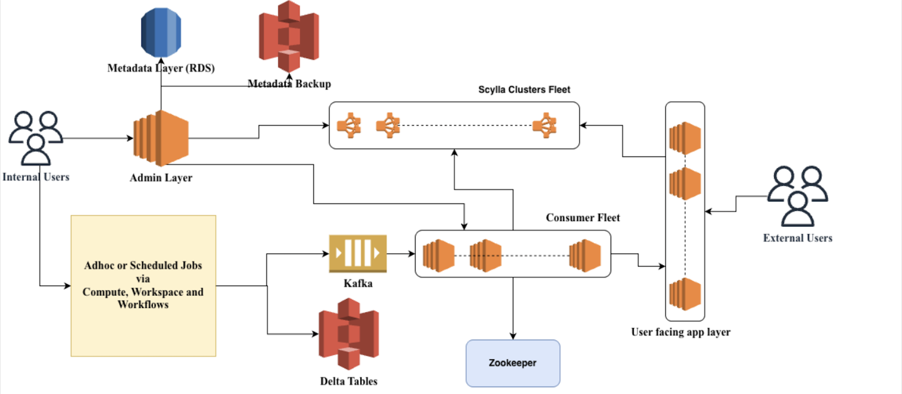

# Feature Store — Architecture, Performance, and Usage

The Darwin Feature Store is a high-performance online feature serving platform designed for ML feature management at scale. It provides single digit millisecond feature reads, streaming ingestion via Kafka, and batch processing through Spark integration.

---

## Architecture Overview



*Diagram created with draw.io — credit: draw.io.*

The system follows a layered architecture:

- **Admin Layer** — Metadata management, schema registry, tenant configuration (MySQL-backed)
- **User-Facing App Layer** — REST API for online feature reads/writes
- **Consumer Fleet** — Kafka consumers for async feature materialization
- **Scylla/Cassandra Clusters** — Distributed storage with tenant-based partitioning
- **Delta Tables** — Offline feature storage for batch access via Spark

---

## Components

| Component | Module | Description |
|-----------|--------|-------------|
| **OFS App** | `app/` | Online feature serving API (read/write) |
| **OFS Admin** | `admin/` | Metadata service, schema management, tenant config |
| **OFS Consumer** | `consumer/` | Kafka consumer for async writes to Cassandra |
| **OFS Populator** | `populator/` | Bulk ingestion from Delta Tables |
| **Spark DataSource** | `spark/` | Spark integration for batch writes |
| **Python SDK** | `python/darwin_fs/` | Client library for Python applications |
| **Core** | `core/` | Shared DTOs, utilities, configurations |

---

## Performance: 200M+ RPM

The Feature Store was load-tested at **200+ million requests per minute** achieving **P99 latency under 4ms**. Key architectural decisions enabling this scale:

- **Tenant-based partitioning**: Isolated Cassandra/ Scylla clusters per tenant with configurable reader/writer routing
- **Async I/O**: Vert.x event loops with RxJava reactive streams throughout
- **Aggressive caching**: Caffeine in-memory cache for metadata, prepared statements, and version info
- **Horizontal scaling**: Stateless app tier with Helix-coordinated consumer partitioning
- **Batching**: Consumer groups messages before writes; configurable batch size limits

---

## Quickstart

### Prerequisites

- Java 11+
- Maven 3.6+
- Docker & Docker Compose
- Python 3.9+ (for SDK)

### Build

```bash
# Build all modules
cd feature-store
mvn clean package -DskipTests

# Build specific service
mvn clean package -pl app -am -DskipTests      # OFS App
mvn clean package -pl admin -am -DskipTests    # OFS Admin
mvn clean package -pl consumer -am -DskipTests # OFS Consumer
```

### Run Locally

```bash
# 1. Start dependencies
docker-compose up -d cassandra mysql kafka zookeeper

# 2. Set environment
export ENV=local
export CASSANDRA_HOST=localhost
export MYSQL_HOST=localhost
export KAFKA_BOOTSTRAP_SERVERS=localhost:9092

# 3. Start Admin service (first — runs migrations)
java -Dapp.environment=local \
  -jar admin/target/darwin-ofs-v2-admin/darwin-ofs-v2-admin-fat.jar

# 4. Start App service
java -Dapp.environment=local \
  -jar app/target/darwin-ofs-v2/darwin-ofs-v2-fat.jar

# 5. Start Consumer service
java -Dapp.environment=local \
  -jar consumer/target/darwin-ofs-v2-consumer/darwin-ofs-v2-consumer-fat.jar
```

### Deploy to Kubernetes

```bash
helm upgrade --install darwin-ofs ./helm/darwin \
  --set services.feature-store.enabled=true \
  --set services.feature-store-admin.enabled=true \
  --set services.feature-store-consumer.enabled=true \
  --set datastores.cassandra.enabled=true \
  --set datastores.mysql.enabled=true \
  --set datastores.kafka.enabled=true
```

---

## SDK Usage

### Installation

```bash
pip install darwin_fs              # Core
pip install darwin_fs[async]       # With async support
pip install darwin_fs[all]         # With PySpark
```

### Create Entity & Feature Group

```python
import darwin_fs
from darwin_fs.model import CreateEntityRequest, CreateFeatureGroupRequest
from darwin_fs.constant.constants import DataType, FeatureGroupType

# Create an entity (defines primary keys)
darwin_fs.create_entity(CreateEntityRequest(
    entity_name="user",
    primary_keys=["user_id"],
    features=[
        {"name": "user_id", "data_type": DataType.BIGINT}
    ],
    owner="foo@bar.com"
))

# Create a feature group
darwin_fs.create_feature_group(CreateFeatureGroupRequest(
    feature_group_name="user_features",
    entity_name="user",
    feature_group_type=FeatureGroupType.ONLINE,
    features=[
        {"name": "age", "data_type": DataType.INT},
        {"name": "signup_days", "data_type": DataType.INT}
    ],
    owner="foo@bar.com"
))
```

### Read Features

```python
from darwin_fs.model import ReadFeaturesRequest, PrimaryKeys

response = darwin_fs.read_features(ReadFeaturesRequest(
    feature_group_name="user_features",
    feature_columns=["user_id", "age", "signup_days"],
    primary_keys=PrimaryKeys(
        names=["user_id"],
        values=[[12345], [67890]]
    )
))

for key in response.successful_keys:
    print(f"User {key.key}: {key.features}")
```

### Write Features (Sync)

```python
from darwin_fs.model import WriteFeaturesRequest, WriteFeatures

darwin_fs.write_features_sync(WriteFeaturesRequest(
    feature_group_name="user_features",
    features=WriteFeatures(
        names=["user_id", "age", "signup_days"],
        values=[
            [12345, 28, 365],
            [67890, 35, 730]
        ]
    )
))
```

### Write Features (Async)

```python
import asyncio
import aiohttp
import darwin_fs

async def write_async():
    async with aiohttp.ClientSession() as session:
        await darwin_fs.write_features_async(session, WriteFeaturesRequest(...))

asyncio.run(write_async())
```

### Spark Integration

```python
from pyspark.sql import SparkSession
import darwin_fs

spark = SparkSession.builder.getOrCreate()
df = spark.read.parquet("features.parquet")

# Write to online store
darwin_fs.write_features(df, "user_features", "v1")

# Read from offline store
offline_df = darwin_fs.read_offline_features(spark, "user_features", "v1")
```

---

## API Examples

### Read Features (curl)

```bash
curl -X POST http://localhost:8080/v1/feature-group/read \
  -H "Content-Type: application/json" \
  -d '{
    "featureGroupName": "user_features",
    "featureGroupVersion": "v0",
    "featureColumns": ["user_id", "age", "signup_days"],
    "primaryKeys": {
      "names": ["user_id"],
      "values": [[12345], [67890]]
    }
  }'
```

### Write Features (curl)

```bash
curl -X POST http://localhost:8080/v1/feature-group/write \
  -H "Content-Type: application/json" \
  -d '{
    "featureGroupName": "user_features",
    "featureGroupVersion": "v0",
    "features": {
      "names": ["user_id", "age", "signup_days"],
      "values": [[12345, 28, 365]]
    }
  }'
```

### Create Entity (Admin API)

```bash
curl -X POST http://localhost:8080/v1/entity \
  -H "Content-Type: application/json" \
  -d '{
    "entity": {
      "tableName": "user",
      "primaryKeys": ["user_id"],
      "features": [
        {"featureName": "user_id", "featureDataType": "BIGINT"}
      ],
      "ttl": 86400
    },
    "owner": "ml-team@example.com",
    "tags": ["user", "core"]
  }'
```

---

## Operational Tips

### Service Startup Order

1. **Datastores**: MySQL → Cassandra → Kafka
2. **Admin Service**: Runs schema migrations, must start first
3. **App Service**: Loads metadata cache from Admin
4. **Consumer Service**: Joins Helix cluster for partition assignment

### Health Checks

```bash
# All services
curl http://localhost:8080/health

# Metrics (Prometheus format)
curl http://localhost:8080/metrics
```

### Key Configuration

| Variable | Description | Default |
|----------|-------------|---------|
| `ENV` | Environment (local/test/prod) | `local` |
| `CASSANDRA_HOST` | Cassandra contact point | `localhost` |
| `CASSANDRA_KEYSPACE` | Default keyspace | `ofs` |
| `MYSQL_HOST` | MySQL host | `localhost` |
| `KAFKA_BOOTSTRAP_SERVERS` | Kafka brokers | `localhost:9092` |

### Caveats

- **Cache Warm-up**: First requests after startup may be slower due to cache population
- **Schema Changes**: Feature group upgrades create new versions; old versions remain readable
- **Tenant Isolation**: Ensure Cassandra clusters are properly configured before enabling multi-tenancy
- **Consumer Lag**: Monitor Kafka consumer lag; scale consumer pods if lag grows

---

## Documentation

- [**ARCHITECTURE.md**](ARCHITECTURE.md) — Detailed architecture, data flows, and operational guidance
- [**Helm Charts**](../helm/darwin/charts/services/feature-store/) — Kubernetes deployment configurations

---

## Module Structure

```
feature-store/
├── core/               # Shared DTOs, utilities, configs
├── app/                # Online Feature Serving API
├── admin/              # Metadata & Admin Service
├── consumer/           # Kafka Consumer Service
├── populator/          # Bulk Ingestion Service
├── spark/              # Spark DataSource
├── python/darwin_fs/   # Python SDK
├── config/             # Environment configs
├── .odin/              # Build scripts
├── ARCHITECTURE.md     # Detailed architecture docs
└── README.md           # This file
```

---

